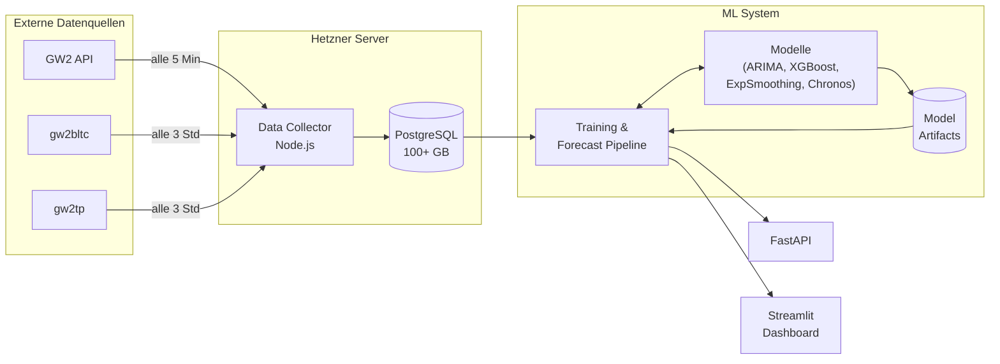

# Infrastruktur-Diagramm

```mermaid
flowchart LR
    subgraph Sources["Externe Datenquellen"]
        GW2["GW2 API"]
        BLTC["gw2bltc"]
        TP["gw2tp"]
    end

    subgraph Server["Hetzner Server"]
        Collector["Data Collector<br/>Node.js"]
        DB[(PostgreSQL<br/>100+ GB)]
    end

    subgraph ML["ML System"]
        Pipeline["Training &<br/>Forecast Pipeline"]
        Models["Modelle<br/>(ARIMA, XGBoost,<br/>ExpSmoothing, Chronos)"]
        Artifacts[("Model<br/>Artifacts")]
    end

    API["FastAPI"]
    UI["Streamlit<br/>Dashboard"]

    GW2 -->|"alle 5 Min"| Collector
    BLTC -->|"alle 3 Std"| Collector
    TP -->|"alle 3 Std"| Collector

    Collector --> DB
    DB --> Pipeline
    Pipeline <--> Models
    Models --> Artifacts
    Artifacts --> Pipeline
    Pipeline --> API
    Pipeline --> UI
```
