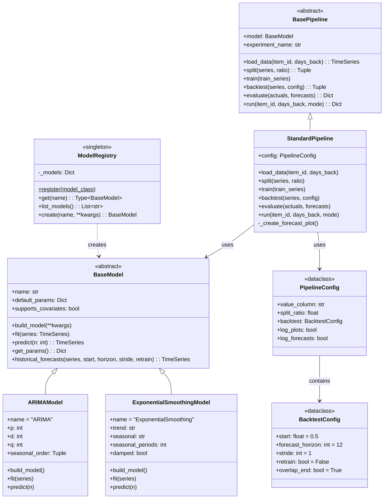
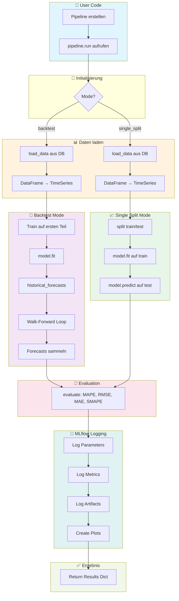
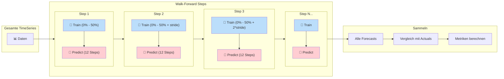
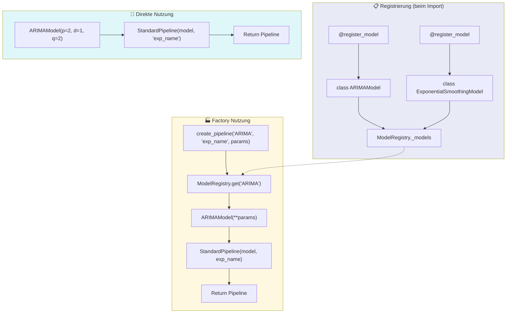
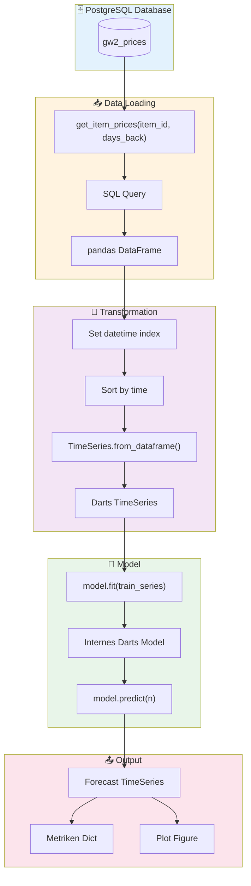
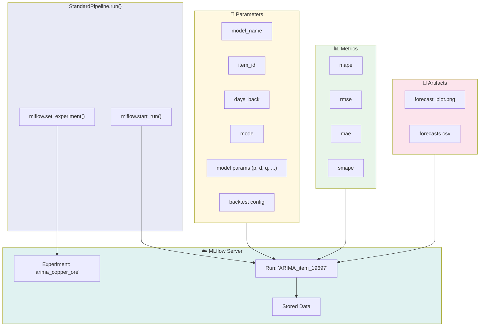
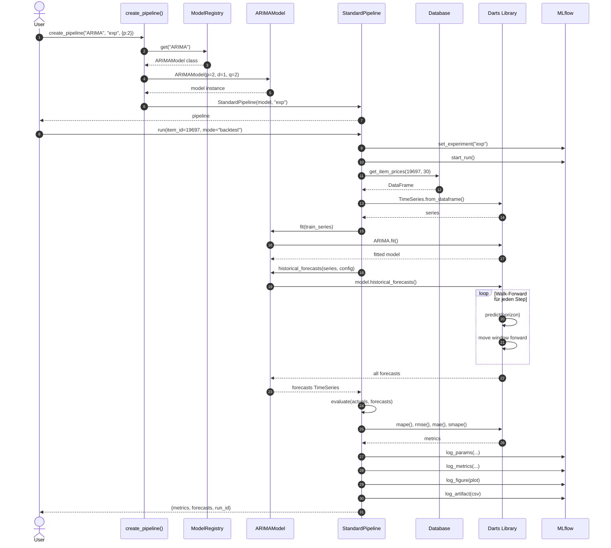
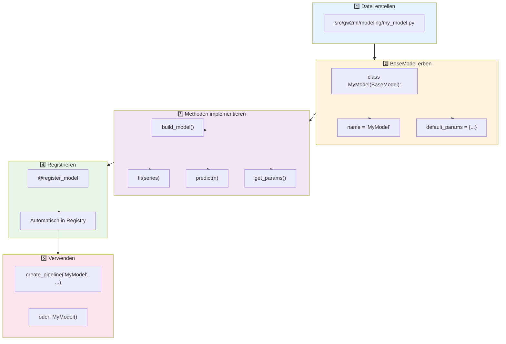
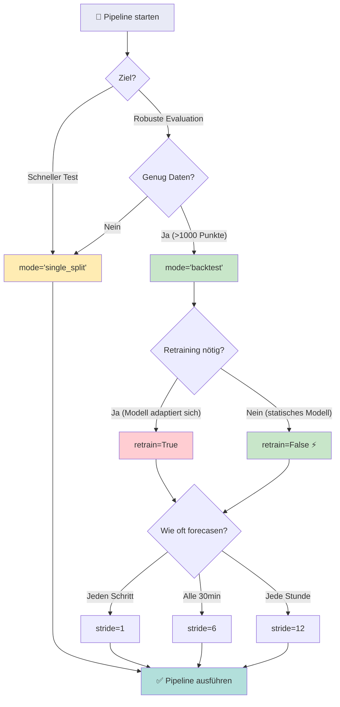

# Pipeline & Model Framework – Flowcharts

## 1. Gesamtübersicht: Klassenstruktur

---

## 2. Pipeline Ablauf: Hauptflow

---

## 3. Backtest: Walk-Forward Validation Detail

---

## 4. Backtest Timeline Visualisierung

```mermaid
gantt
    title Walk-Forward Backtesting Timeline
    dateFormat X
    axisFormat %s
    
    section Daten
    Gesamte Serie (30 Tage)     :data, 0, 100
    
    section Training
    Initial Train (50%)         :train1, 0, 50
    
    section Forecasts
    Forecast 1 (12 Steps)       :forecast1, 50, 62
    Forecast 2 (12 Steps)       :forecast2, 51, 63
    Forecast 3 (12 Steps)       :forecast3, 52, 64
    Forecast 4 (12 Steps)       :forecast4, 53, 65
    ...mehr Forecasts...        :more, 60, 72
```

---

## 5. Model Registry & Factory Flow

---

## 6. Datenfluss: Von DB bis Forecast

---

## 7. MLflow Integration Detail

---

## 8. Vollständiger Sequenzablauf

---

## 9. Erweiterung: Neues Modell hinzufügen

---

## 10. Entscheidungsbaum: Welchen Mode wählen?

