# Pipeline & Model Framework – Flowcharts

## 1. Gesamtübersicht: Klassenstruktur

---

## 2. Pipeline Ablauf: Hauptflow

```mermaid
flowchart TD
    subgraph USER["👤 User Code"]
        A[Pipeline erstellen] --> B[pipeline.run aufrufen]
    end
    
    subgraph INIT["🔧 Initialisierung"]
        B --> C{Mode?}
    end
    
    subgraph DATA["📊 Daten laden"]
        C -->|backtest| D1[load_data aus DB]
        C -->|single_split| D2[load_data aus DB]
        D1 --> E1[DataFrame → TimeSeries]
        D2 --> E2[DataFrame → TimeSeries]
    end
    
    subgraph BACKTEST["🔄 Backtest Mode"]
        E1 --> F1[Train auf ersten Teil]
        F1 --> G1[model.fit]
        G1 --> H1[historical_forecasts]
        H1 --> I1[Walk-Forward Loop]
        I1 --> J1[Forecasts sammeln]
    end
    
    subgraph SINGLE["📈 Single Split Mode"]
        E2 --> F2[split train/test]
        F2 --> G2[model.fit auf train]
        G2 --> H2[model.predict auf test]
    end
    
    subgraph EVAL["📏 Evaluation"]
        J1 --> K[evaluate: MAPE, RMSE, MAE, SMAPE]
        H2 --> K
    end
    
    subgraph MLFLOW["📝 MLflow Logging"]
        K --> L[Log Parameters]
        L --> M[Log Metrics]
        M --> N[Log Artifacts]
        N --> O[Create Plots]
    end
    
    subgraph RESULT["✅ Ergebnis"]
        O --> P[Return Results Dict]
    end
    
    style USER fill:#e1f5fe
    style DATA fill:#fff3e0
    style BACKTEST fill:#f3e5f5
    style SINGLE fill:#e8f5e9
    style EVAL fill:#fce4ec
    style MLFLOW fill:#e0f2f1
    style RESULT fill:#f1f8e9
```

---

## 3. Backtest: Walk-Forward Validation Detail

```mermaid
flowchart LR
    subgraph SERIES["Gesamte TimeSeries"]
        direction LR
        S1[📊 Daten]
    end
    
    subgraph WALK["Walk-Forward Steps"]
        direction TB
        
        subgraph STEP1["Step 1"]
            T1["🔵 Train (0% - 50%)"] --> P1["🔴 Predict (12 Steps)"]
        end
        
        subgraph STEP2["Step 2"]
            T2["🔵 Train (0% - 50% + stride)"] --> P2["🔴 Predict (12 Steps)"]
        end
        
        subgraph STEP3["Step 3"]
            T3["🔵 Train (0% - 50% + 2*stride)"] --> P3["🔴 Predict (12 Steps)"]
        end
        
        subgraph STEPN["Step N..."]
            TN["🔵 Train"] --> PN["🔴 Predict"]
        end
    end
    
    subgraph COLLECT["Sammeln"]
        direction TB
        C1[Alle Forecasts] --> C2[Vergleich mit Actuals]
        C2 --> C3[Metriken berechnen]
    end
    
    S1 --> STEP1
    STEP1 --> STEP2
    STEP2 --> STEP3
    STEP3 --> STEPN
    STEPN --> C1
    
    style T1 fill:#bbdefb
    style T2 fill:#bbdefb
    style T3 fill:#bbdefb
    style TN fill:#bbdefb
    style P1 fill:#ffcdd2
    style P2 fill:#ffcdd2
    style P3 fill:#ffcdd2
    style PN fill:#ffcdd2
```

---

## 4. Backtest Timeline Visualisierung

---

## 5. Model Registry & Factory Flow

```mermaid
flowchart TD
    subgraph REGISTER["📋 Registrierung (beim Import)"]
        A1["@register_model"] --> A2["class ARIMAModel"]
        A3["@register_model"] --> A4["class ExponentialSmoothingModel"]
        A2 --> R["ModelRegistry._models"]
        A4 --> R
    end
    
    subgraph FACTORY["🏭 Factory Nutzung"]
        B1["create_pipeline('ARIMA', 'exp_name', params)"]
        B1 --> B2["ModelRegistry.get('ARIMA')"]
        B2 --> B3["ARIMAModel(**params)"]
        B3 --> B4["StandardPipeline(model, exp_name)"]
        B4 --> B5["Return Pipeline"]
    end
    
    subgraph DIRECT["🔧 Direkte Nutzung"]
        C1["ARIMAModel(p=2, d=1, q=2)"]
        C1 --> C2["StandardPipeline(model, 'exp_name')"]
        C2 --> C3["Return Pipeline"]
    end
    
    R -.-> B2
    
    style REGISTER fill:#e8eaf6
    style FACTORY fill:#fff8e1
    style DIRECT fill:#e0f7fa
```

---

## 6. Datenfluss: Von DB bis Forecast

```mermaid
flowchart TD
    subgraph DB["🗄️ PostgreSQL Database"]
        DB1[(gw2_prices)]
    end
    
    subgraph LOAD["📥 Data Loading"]
        L1["get_item_prices(item_id, days_back)"]
        L2["SQL Query"]
        L3["pandas DataFrame"]
    end
    
    subgraph TRANSFORM["🔄 Transformation"]
        T1["Set datetime index"]
        T2["Sort by time"]
        T3["TimeSeries.from_dataframe()"]
        T4["Darts TimeSeries"]
    end
    
    subgraph MODEL["🤖 Model"]
        M1["model.fit(train_series)"]
        M2["Internes Darts Model"]
        M3["model.predict(n)"]
    end
    
    subgraph OUTPUT["📤 Output"]
        O1["Forecast TimeSeries"]
        O2["Metriken Dict"]
        O3["Plot Figure"]
    end
    
    DB1 --> L1
    L1 --> L2
    L2 --> L3
    L3 --> T1
    T1 --> T2
    T2 --> T3
    T3 --> T4
    T4 --> M1
    M1 --> M2
    M2 --> M3
    M3 --> O1
    O1 --> O2
    O1 --> O3
    
    style DB fill:#e3f2fd
    style LOAD fill:#fff3e0
    style TRANSFORM fill:#f3e5f5
    style MODEL fill:#e8f5e9
    style OUTPUT fill:#fce4ec
```

---

## 7. MLflow Integration Detail

---

## 8. Vollständiger Sequenzablauf

```mermaid
sequenceDiagram
    autonumber
    
    actor User
    participant Factory as create_pipeline()
    participant Registry as ModelRegistry
    participant Model as ARIMAModel
    participant Pipeline as StandardPipeline
    participant DB as Database
    participant Darts as Darts Library
    participant MLflow as MLflow
    
    User->>Factory: create_pipeline("ARIMA", "exp", {p:2})
    Factory->>Registry: get("ARIMA")
    Registry-->>Factory: ARIMAModel class
    Factory->>Model: ARIMAModel(p=2, d=1, q=2)
    Model-->>Factory: model instance
    Factory->>Pipeline: StandardPipeline(model, "exp")
    Pipeline-->>User: pipeline
    
    User->>Pipeline: run(item_id=19697, mode="backtest")
    
    Pipeline->>MLflow: set_experiment("exp")
    Pipeline->>MLflow: start_run()
    
    Pipeline->>DB: get_item_prices(19697, 30)
    DB-->>Pipeline: DataFrame
    
    Pipeline->>Darts: TimeSeries.from_dataframe()
    Darts-->>Pipeline: series
    
    Pipeline->>Model: fit(train_series)
    Model->>Darts: ARIMA.fit()
    Darts-->>Model: fitted model
    
    Pipeline->>Model: historical_forecasts(series, config)
    Model->>Darts: model.historical_forecasts()
    
    loop Walk-Forward für jeden Step
        Darts->>Darts: predict(horizon)
        Darts->>Darts: move window forward
    end
    
    Darts-->>Model: all forecasts
    Model-->>Pipeline: forecasts TimeSeries
    
    Pipeline->>Pipeline: evaluate(actuals, forecasts)
    Pipeline->>Darts: mape(), rmse(), mae(), smape()
    Darts-->>Pipeline: metrics
    
    Pipeline->>MLflow: log_params(...)
    Pipeline->>MLflow: log_metrics(...)
    Pipeline->>MLflow: log_figure(plot)
    Pipeline->>MLflow: log_artifact(csv)
    
    Pipeline-->>User: {metrics, forecasts, run_id}
```

---

## 9. Erweiterung: Neues Modell hinzufügen

---

## 10. Entscheidungsbaum: Welchen Mode wählen?

```mermaid
flowchart TD
    START["🚀 Pipeline starten"] --> Q1{"Ziel?"}
    
    Q1 -->|"Robuste Evaluation"| Q2{"Genug Daten?"}
    Q1 -->|"Schneller Test"| SINGLE["mode='single_split'"]
    
    Q2 -->|"Ja (>1000 Punkte)"| BACKTEST["mode='backtest'"]
    Q2 -->|"Nein"| SINGLE
    
    BACKTEST --> Q3{"Retraining nötig?"}
    Q3 -->|"Ja (Modell adaptiert sich)"| RETRAIN["retrain=True"]
    Q3 -->|"Nein (statisches Modell)"| NO_RETRAIN["retrain=False ⚡"]
    
    RETRAIN --> Q4{"Wie oft forecasen?"}
    NO_RETRAIN --> Q4
    
    Q4 -->|"Jeden Schritt"| STRIDE1["stride=1"]
    Q4 -->|"Alle 30min"| STRIDE6["stride=6"]
    Q4 -->|"Jede Stunde"| STRIDE12["stride=12"]
    
    SINGLE --> DONE["✅ Pipeline ausführen"]
    STRIDE1 --> DONE
    STRIDE6 --> DONE
    STRIDE12 --> DONE
    
    style START fill:#e8eaf6
    style BACKTEST fill:#c8e6c9
    style SINGLE fill:#ffecb3
    style RETRAIN fill:#ffcdd2
    style NO_RETRAIN fill:#c8e6c9
    style DONE fill:#b2dfdb
```

