# Pipeline Übersicht: Von Daten zum Forecast

## 🎯 Die 6 Schritte (Einfach)

```mermaid
flowchart LR
    subgraph S1["1️⃣ DATEN"]
        A1[("🗄️ PostgreSQL")]
    end
    
    subgraph S2["2️⃣ LADEN"]
        A2["📥 get_prices()"]
    end
    
    subgraph S3["3️⃣ TRANSFORM"]
        A3["🔄 → TimeSeries"]
    end
    
    subgraph S4["4️⃣ TRAINING"]
        A4["🎓 model.fit()"]
    end
    
    subgraph S5["5️⃣ FORECAST"]
        A5["🔮 model.predict()"]
    end
    
    subgraph S6["6️⃣ AUSWERTEN"]
        A6["📊 Metriken"]
    end
    
    S1 --> S2 --> S3 --> S4 --> S5 --> S6
    
    style S1 fill:#e3f2fd
    style S2 fill:#fff3e0
    style S3 fill:#f3e5f5
    style S4 fill:#e8f5e9
    style S5 fill:#fff9c4
    style S6 fill:#fce4ec
```



---

## 📋 Detail pro Schritt

### 1️⃣ DATEN (PostgreSQL)

**Was haben wir:**
| Tabelle | Beschreibung | Intervall |
|---------|--------------|-----------|
| `prices` | Aktuelle GW2 TP Preise | ~5 Min |
| `gw2bltc_historical_prices` | Historische Daten (BLTC) | variabel |
| `gw2tp_historical_prices` | Historische Daten (TP) | variabel |

**Spalten (prices):**
```
item_id, buy_unit_price, sell_unit_price, buy_quantity, sell_quantity, fetched_at
```

---

### 2️⃣ LADEN (Data Retrieval)

**Aktuell verfügbar:**

```python
# Option A: database_queries.py (empfohlen)
from gw2ml.data.database_queries import get_prices

df = get_prices(
    connection,
    item_id=19697,
    last_days=30
)

# Option B: DataRetriever (komplexer)
from gw2ml.data.retriever import DataRetriever

retriever = DataRetriever()
df = retriever.get_data(
    symbol="19697",
    source="DAMU",
    start_time=...,
    end_time=...
)
```

**⚠️ Verbesserungspotential:** Siehe Abschnitt unten

---

### 3️⃣ TRANSFORM (DataFrame → TimeSeries)

```python
import pandas as pd
from darts import TimeSeries

# 1. Datetime setzen
df['fetched_at'] = pd.to_datetime(df['fetched_at'])
df = df.set_index('fetched_at').sort_index()

# 2. Timezone entfernen (Darts mag keine Timezones)
if df.index.tz is not None:
    df.index = df.index.tz_localize(None)

# 3. Zu TimeSeries konvertieren
series = TimeSeries.from_dataframe(df, value_cols=['buy_unit_price'])
```

**⚠️ Verbesserungspotential:** Helper-Funktion erstellen

---

### 4️⃣ TRAINING

```python
# Split
train, test = series.split_after(0.8)

# Fit
model.fit(train)
```

---

### 5️⃣ FORECAST

**Single Prediction:**
```python
forecast = model.predict(n=12)  # 12 Steps = 1 Stunde
```

**Backtesting (Walk-Forward):**
```python
forecasts = model.historical_forecasts(
    series=series,
    start=0.5,           # Ab 50% der Daten
    forecast_horizon=12, # 12 Steps voraus
    stride=1,            # Jeden Schritt
    retrain=False        # Nicht neu trainieren
)
```

---

### 6️⃣ AUSWERTEN

```python
from darts.metrics import mape, rmse, mae, smape

metrics = {
    "mape": mape(actual, forecast),
    "rmse": rmse(actual, forecast),
    "mae": mae(actual, forecast),
    "smape": smape(actual, forecast),
}
```

---

## 🔴 Verbesserungspotential

### A. Daten Laden (Priorität: HOCH)

**Problem:** Aktuell gibt es zwei Wege (`get_prices`, `DataRetriever`) die nicht konsistent sind.

**Vorschlag: Einfache Wrapper-Funktion**

```mermaid
flowchart TD
    subgraph CURRENT["❌ Aktuell: 2 Wege"]
        C1["get_prices()"]
        C2["DataRetriever.get_data()"]
    end
    
    subgraph PROPOSED["✅ Vorschlag: 1 einfacher Weg"]
        P1["get_gw2_prices(item_id, days_back)"]
        P2["→ DataFrame"]
    end
    
    CURRENT -.->|"vereinfachen"| PROPOSED
```



**Neue Funktion:**

```python
# src/gw2ml/data/loaders.py

def get_gw2_prices(
    item_id: int,
    days_back: int = 30,
    value_column: str = "buy_unit_price"
) -> pd.DataFrame:
    """
    Einfachster Weg um GW2 Preisdaten zu laden.
    
    Returns:
        DataFrame mit Spalten: fetched_at, {value_column}
        Sortiert nach Zeit, bereit für TimeSeries Konvertierung.
    """
    from .database_queries import get_prices
    from .database_client import DatabaseClient
    
    client = DatabaseClient.from_env()
    df = get_prices(client, item_id, last_days=days_back)
    
    # Nur benötigte Spalten
    df = df[['fetched_at', value_column]].copy()
    df = df.sort_values('fetched_at')
    
    return df
```

---

### B. Transform (Priorität: MITTEL)

**Problem:** TimeSeries-Konvertierung ist immer gleich, aber wird überall neu geschrieben.

**Vorschlag: Helper-Funktion**

```python
# src/gw2ml/data/loaders.py

def to_timeseries(
    df: pd.DataFrame,
    time_col: str = "fetched_at",
    value_col: str = "buy_unit_price"
) -> TimeSeries:
    """
    Konvertiert DataFrame zu Darts TimeSeries.
    Behandelt Timezone-Probleme automatisch.
    """
    from darts import TimeSeries
    
    df = df.copy()
    df[time_col] = pd.to_datetime(df[time_col])
    
    if df[time_col].dt.tz is not None:
        df[time_col] = df[time_col].dt.tz_localize(None)
    
    df = df.set_index(time_col).sort_index()
    
    return TimeSeries.from_dataframe(df, value_cols=[value_col])
```

---

### C. All-in-One Loader (Priorität: MITTEL)

**Kombination aus A + B:**

```python
# src/gw2ml/data/loaders.py

def load_gw2_series(
    item_id: int,
    days_back: int = 30,
    value_column: str = "buy_unit_price"
) -> TimeSeries:
    """
    Lädt GW2 Daten und gibt direkt eine TimeSeries zurück.
    
    Example:
        series = load_gw2_series(19697, days_back=30)
        train, test = series.split_after(0.8)
    """
    df = get_gw2_prices(item_id, days_back, value_column)
    return to_timeseries(df, value_col=value_column)
```

---

### D. Caching (Priorität: NIEDRIG)

**Problem:** Bei wiederholten Experimenten werden Daten immer neu aus DB geladen.

**Vorschlag:**

```python
@functools.lru_cache(maxsize=100)
def load_gw2_series_cached(item_id: int, days_back: int) -> TimeSeries:
    """Cached Version für wiederholte Experimente."""
    return load_gw2_series(item_id, days_back)
```

---

## 📊 Zusammenfassung: Was fehlt?

```mermaid
flowchart TD
    subgraph EXISTS["✅ Existiert bereits"]
        E1["PostgreSQL DB"]
        E2["get_prices()"]
        E3["DataRetriever"]
        E4["Darts Models"]
        E5["MLflow"]
        E6["Metriken"]
    end
    
    subgraph MISSING["🔴 Fehlt noch"]
        M1["BaseModel ABC"]
        M2["ARIMAModel"]
        M3["ExpSmoothingModel"]
        M4["BasePipeline ABC"]
        M5["StandardPipeline"]
        M6["Model Registry"]
        M7["Einfacher Data Loader"]
        M8["TimeSeries Helper"]
    end
    
    subgraph NICE["🟡 Nice-to-Have"]
        N1["Caching"]
        N2["Hyperparameter Search"]
        N3["Multiple Items parallel"]
    end
```



---

## 🚀 Empfohlene Reihenfolge

| Prio | Was | Warum |
|------|-----|-------|
| 1 | `load_gw2_series()` Helper | Einfachster Einstieg, wird überall gebraucht |
| 2 | `BaseModel` + `ARIMAModel` | Basis für alle Modelle |
| 3 | `ExponentialSmoothingModel` | Zweites Basis-Modell |
| 4 | `BasePipeline` + `StandardPipeline` | Orchestrierung |
| 5 | Model Registry | Erweiterbarkeit |
| 6 | Caching | Performance (optional) |

---

## 💡 Quick Start nach Implementierung

```python
# So einfach soll es sein:

from gw2ml.data import load_gw2_series
from gw2ml.modeling import ARIMAModel
from gw2ml.pipeline import StandardPipeline

# Daten laden (1 Zeile!)
series = load_gw2_series(item_id=19697, days_back=30)

# Pipeline erstellen
model = ARIMAModel(p=2, d=1, q=2)
pipeline = StandardPipeline(model, "my_experiment")

# Ausführen mit Backtesting
results = pipeline.run(series, mode="backtest")

print(f"MAPE: {results['metrics']['mape']:.2f}%")
```

